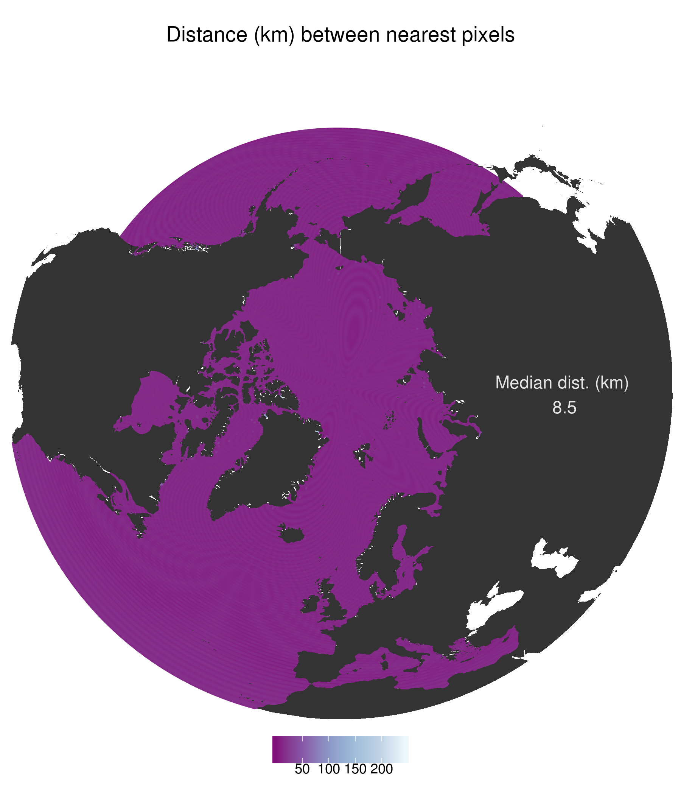
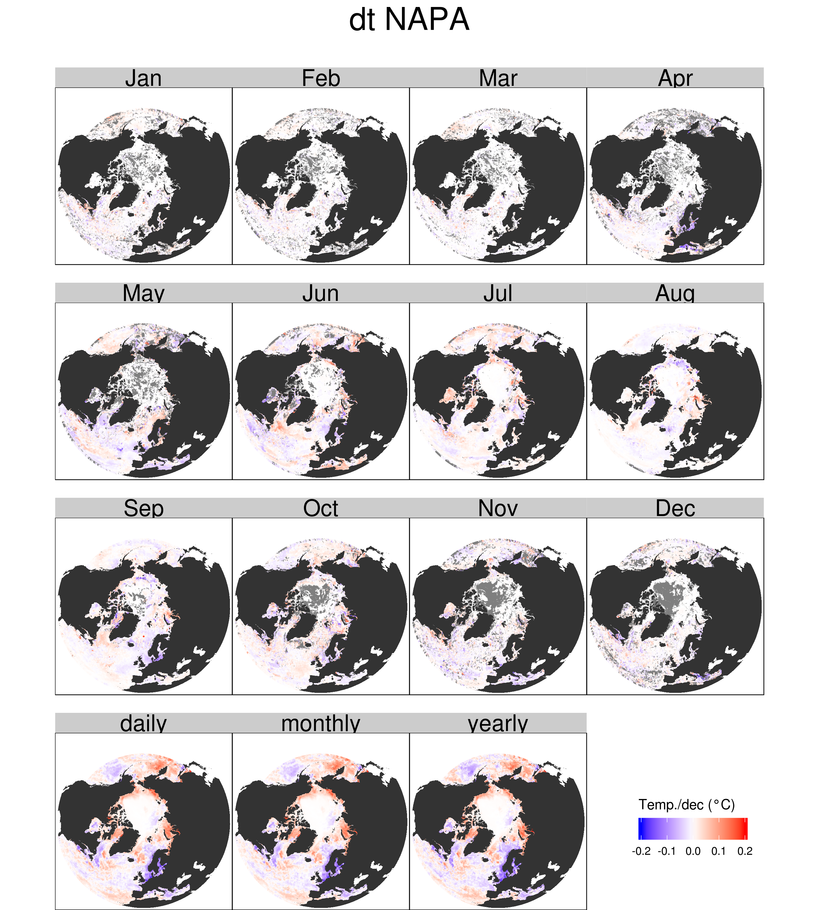

# Overview

The following select figures illustrate important differences between the NAPA model output and the NOAA OISST v2 product as well as AVISO+ SLA.

One may use the table of contents tab on the left side of this document to jump to a desired location.

Most of the figures below consist of 13 panels. The first 12 panels will show the statistic in question being compared between the NAPA and OISST/AVISO data for only a given month, as labelled at the top of the panel. This is done in lieu of showing seasons so as to provide more insight into the data and not artificially constrain the results. The last panel at the bottom of most figures shows the resultant statistic when the entire datasets are compared.

# Distances

Firstly we look at the distance between the nearest OISST/AVISO pixel being compared to each NAPA pixel. Note that most pixels are within a few kms of one another, with the exception of several nearshore points that are not resolved in the model.

It should be noted here that the OISST and AVISO products have the same lon/lat extent and so only one mask is required to compare these two products against the NAPA data. There are many pixels in the NAPA data that are closer together than the 0.25 degree resolution of the observation products. In this case all of the NAPA pixels are still compared to the nearest observation pixel, rather than creating means first.

# Basic comparisons

The following subsections show the results of comparing basic summary statistics between the NAPA and OISST/AVISO data for each co-located pixel as seen in the distances section above.

There are simply too many figures with too many panels to include here. It will rather be necessary to select key panels that illustrate specific patterns of interest or that are important for other reasons.

## Quantiles

## Min Mean Max

The mean differences are shown here to highlight what is a rather consistent pattern between these two products. That being that NAPA is either putting the Gulf Stream North of were the OISST has it, or is thinking it is much warmer. The NAPA data do show that the Labrador Sea is warmer than in the OISST data. The Arctic Ocean north of Scandinavia is cooler in the NAPA data, as well as the Atlantic south of where it thinks the Gulf Stream is. These patterns tend to hold rather consistent throughout all months, with the exception of the ocean north of Hudson Bay being warmer in the NAPA data during late summer.

## Std. Dev.

The variance (shown here as standard deviation) of the Gulf Stream and Labrador Current are greater in the NAPA data, as well as the oceans above Scandinavia and the Hudson Bay, similar to the mean differences. There is a much larger range of seasonal differences however and on a month by month basis there is usually more variance observed in the OISST data.

# Long-term trends

## NAPA

First looking at the NAPA data we see it has the waters of the diffuse end of the Gulf Stream having a long-term cooling trend. The NAPA data also show that the Gulf Stream jet has a strong (~0.15C/dec) warming trend. Much of the Atlantic shows a slight cooling trend, too.

## OISST

The OISST data agree with the IPCC findings on long-term climate trends. That being that the oceans generally are warming at ~0.1C/dec. We do however see some strong cooling patterns along the south Atlantic coast of the US during winter months. There is also an overall cooling trend in the Gulf Stream that is likely caused by changes to the meandering of the current as it approaches Europe.

## Difference

When we compare these two products we see that the NAPA data are showing a much stronger warming trend for the Gulf Stream and Labrador Current, whereas the trend for the Atlantic ocean broadly is much cooler.

# Correlations

The correlation values below show the overall correlations per pixel at different time scales (other than per month) in the top row. The first panel shows the correlations for overall (daily) values, the second panel shows the correlations for monthly means, and the third panel shows the correlations for yearly means. The rest of the panels show the daily correlations during only the labelled months, as is standard for most other figures.

## Complete time series

We see that correlations are better with monthly means than either daily, with much of the arctic circle showing negative correlations with the yearly values. This implies that the interannual variability matches well between the datasets, but that the annual signals in some areas are showing opposite long-term trends. We also see that the negative correlations within the Arctic circle vary seasonally.

## Decomposed time series

# Skewness comparisons

In many of the figures above one will notice that the Gulf Stream is consistently different between the NAPA and OISST data. In order to better visualise this, AVISO+ data were downloaded so that the difference in the per pixel skewness of sea level anomalies (SLA) between the data could be determined. The skewness of SLA is a useful tool for determining large-scale persistent oceanographic feature, particularly the Gulf Stream.

## AVISO
One may see the very clear dipole in SLA skewness that clearly highlights the path of the Gulf Stream.

## NAPA

The Arctic circle shows a consistent positive skewness while there appear to be two or three dipole structures moving east across the Atlantic.

## Comparison

In the two figures above one may see that the path of the Gulf Stream is more clear in the AVISO data than the NAPA data however, when we compare the two products the resultant values do not create a new dipole indicating the positional difference in the Gulf Stream between the two products. This implies that the NAPA data are not placing the bulk of the Gulf Stream further north than the OISST data, but that rather the NAPA data are simply calculating the waters north of the Gulf Stream to be warmer due to some other reason. Perhaps they underestimate the influx of cold equatorward flowing water from the Labrador current.

# MHW comparisons

With many summary statistic and applied statistical comparisons of the products complete, the results from calculating marine heatwaves (MHWs) were then compared.

First we will look at the seasonal and thresholds climatologies created for the calculation of MHWs, and then for the MHW metrics themselves. Of primary interest are the duration and intensity of events, and so the 20+ other metrics generated by the detection function were discarded.

## Seasonal and threshold clims

There were many figures generated for these statistics, but in the interest of space/time we will show only two for each primary output.

### Central tendency

The difference of the measurement of central tendency for the seasonal and threshold climatologies per pixel were determined using simple _t_-tests.

When looking at the difference in the seasonal signal below we see some interesting artifacts emerge, particularly in the seasonal panels. Overall we see that the open oceans tend not to have significantly different seasonal signals, but that the areas with some ice coverage do. Additionally, the monthly panels seem to show outlines of particular features, such as the Gulf Stream and Labrador Current/Sea were the edges upon which these meso-scale features would be abutting something else do not differ significantly between the datasets, but they do almost everywhere else. I'm not certain why this would be, but it is very pronounced.

The following figure shows _t_-test results for the 90th percentile threshold climatology at each pixel. Surprisingly, the overall results are generally more similar than the seasonal signals. The monthly patterns differ but the general pattern of meso-scale borders being similar remains.

### Distribution

When we look at the difference in the distribution of the seasonal and threshold climatologies using Kolmogorov-Smirnov tests we still see that the borders of meso-scale features stand out, but now the overall agreement between the datasets plummets, while the monthly agreement increases dramatically. This is most clear in the winter months. This implies that the warmer months of the year are resolved differently in the model than the OISST data, but that winter is much more similar. 

The patterns are relatively similar for both the seasonal climatologies, as seen in the following figure, and for the threshold climatologies, as seen in the figure after that.

## MHW metrics

The Min, Mean, and Max were calculated for the duration and maximum intensity of all MHWs per pixel but we will rather show here the difference in the calculation via _t_-test results in the interest of saving time/space.

It must first be noted that there are many pixels in which there were not more than three MHWs detected in a given month and so no test statistic could be generated. These pixels appear grey in the following figures.

### Duration

The following figure shows that on a month by month basis the duration of detected events do not tend to differ significantly, but when we look at overall time series per pixel they do. Furthermore, the open oceans tend to be in better agreement than areas with ice coverage.

### Maximum intensity

When we look at the maximum intensities for all of the MHWs that occurred per pixel (not the overall maximum intensity of the one largest event) we see that the areas that do and do not agree between datasets are almost inverted. This means that the NAPA and OISST data are seeing significantly different sized events in the open ocean as opposed to the areas with sea ice, though of similar lengths. This is perhaps one of the more interesting findings and may be worth investigating in more detail.

Upon cursory analysis it appears as though this may be due to the duration of events being so much longer in the NAPA than OISST data, with events being somewhat more intense in the OISST data.

# Conclusion

These two products are not dramatically different, but enough so that important features are statistically differently when using several statistical approaches.

The temperatures for the Gulf Stream and Labrador Current appear to be the most dissimilar. In order to determine why the Gulf Stream appeared to be out of place in the NAPA data, the SLA skewness per pixel was compared between NAPA and AVISO. It was found that the path of the Gulf Stream is not as crisp in the NAPA data, but that it is not clearly running north of where the OISST data put it. This then implies that the warmer signal around the Scotian Shelf is perhaps not due to the Gulf Stream but rather the Labrador Current being underrepresented. This would also explain why this current is warmer in the NAPA data compared against the OISST data.

The seasonal signals per pixel are more similar per month than they are overall, with most pixels being significantly different overall, but similar by month. In areas where the overall signals are significantly different we still see the borders of meso-scale features highlighted as not significantly different. This implies that the model is resolving the different meso-scale features in the study area accurately spatially, but that the seasonal timing of the temperatures differ.

Of the pixels that had three or more MHWs detected for any given month, most pixels show an agreement between the mean duration and intensity of these events. When taken as an overall time series however these differences are mostly significant. Interestingly, the overall spatial agreement of MHW durations is almost inverted from the spatial agreement of pixels that share similar MHW maximum intensities. This is likely due to the very large difference in the duration of events between the datasets, with NAPA having much longer events on average.

