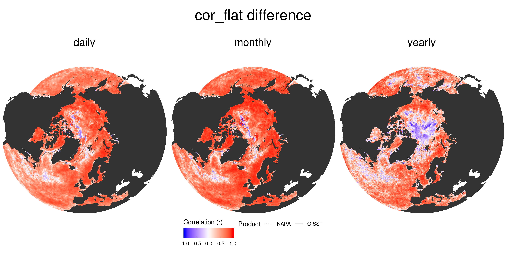
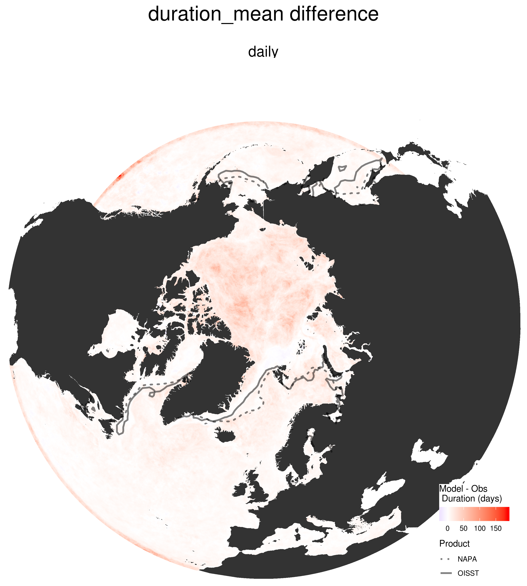
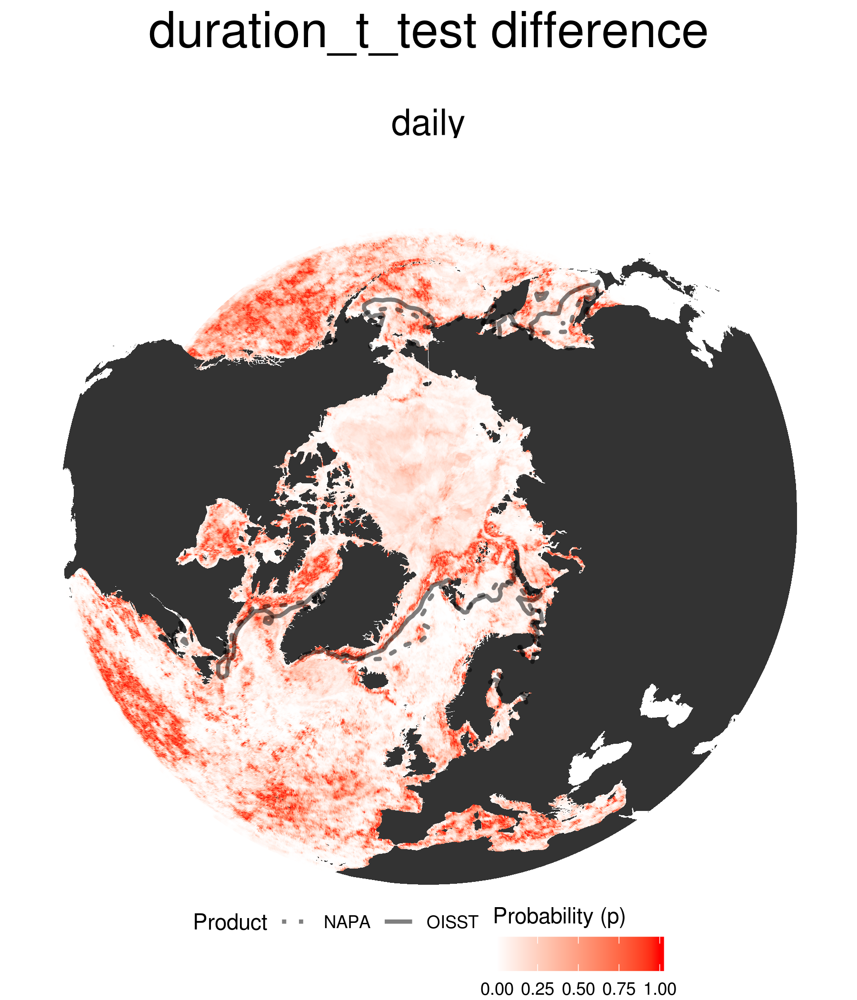
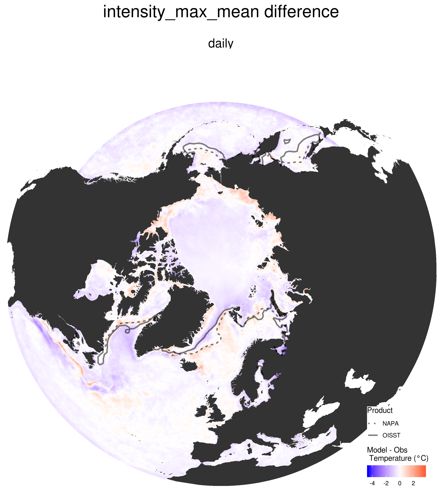

```{r, echo = FALSE}
library(knitr)
```


## Overview

The following select figures illustrate important differences between the NAPA model output and the NOAA OISST v2 product for SST and proportions of ice coverage. AVISO+ SLA is used to compare against the SSH present in the NAPA model.
  
There are many more figures available showing a multitude of comparisons, but only select figures that highlight important differences are shown here.
  
Please provide me with a USB stick or hard drive if you would like the full output as it is ~260 MB.


## Distance between pixels

```{r, echo = FALSE, fig.align='center'}
include_graphics("graph/diff_figs/distance.png")
```


## Ice Coverage Minimum 

```{r, echo = FALSE, fig.align='center'}
include_graphics("graph/diff_figs/ice_min_difference.png")
```


## Ice Coverage Maximum

```{r, echo = FALSE, fig.align='center'}

```


## SST Mean

```{r, echo = FALSE, fig.align='center'}
include_graphics("graph/diff_figs/mean_difference.png")
```


## SST Decadal Trend

```{r, echo = FALSE, fig.align='center'}

```


## Correlations - normal

```{r, echo = FALSE, fig.align='center'}
include_graphics("graph/diff_figs/cor_norm_difference.png")
```


## Correlations - detrended

```{r, echo = FALSE, fig.align='center'}

```


## Seasonal Climatology - mean

```{r, echo = FALSE, fig.align='center'}
include_graphics("graph/diff_figs/seas_mean_difference.png")
```

## Seasonal Climatology - Kolmogorov-Smirnov

```{r, echo = FALSE, fig.align='center'}
include_graphics("graph/diff_figs/seas_KS_test_difference.png")
```


## Problem Area - Gulf Stream 1/2
### SLA Only

```{r, echo = FALSE, fig.align='center'}
include_graphics("graph/GS/skewness.png")
```


## Problem Area - Gulf Stream 2/2
### SLA + SST

```{r, echo = FALSE, fig.align='center'}
include_graphics("graph/GS/SST_SSH.png")
```

## Problem Area - Labrador Sea


## Problem Area - Greenland Sea


## Marine Heatwaves Definition 1/4
### Time series

```{r, echo = FALSE, fig.align='center'}
include_graphics("graph/presentations/ts_full.png")
```


## Marine Heatwaves Definition 2/4
### Daily boxes

```{r, echo = FALSE, fig.align='center'}
include_graphics("graph/presentations/ts_box.png")
```


## Marine Heatwaves Definition 3/4
### Thresholds

```{r, echo = FALSE, fig.align='center'}
include_graphics("graph/presentations/ts_box_clim.png")
```


## Marine Heatwaves Definition 4/4
### Events

```{r, echo = FALSE, fig.align='center'}
include_graphics("graph/presentations/MHW.png")
```


## Marine Heatwave Count

```{r, echo = FALSE, fig.align='center'}

```


## Marine Heatwave Duration - Min

```{r, echo = FALSE, fig.align='center'}

```


## Marine Heatwave Duration - Mean

```{r, echo = FALSE, fig.align='center'}

```


## Marine Heatwave Duration - Max

```{r, echo = FALSE, fig.align='center'}
include_graphics("graph/diff_figs/duration_max_difference.png")
```


## Marine Heatwave Duration - _t_-test

```{r, echo = FALSE, fig.align='center'}

```


## Marine Heatwave Intensity - Mean

```{r, echo = FALSE, fig.align='center'}

```


## Marine Heatwave Duration - _t_-test

```{r, echo = FALSE, fig.align='center'}

```


## Conclusions - SST

* Mean differences per pixel range from ....

* Three problem ares:
  * Gulf Stream
  * Labrador Sea
  * Greenland Sea


## Conclusions - Gulf Steam

* It was found that the path of the Gulf Stream is not as crisp in the NAPA data, but that its mean pathway is very similar
* but it does appear that it may be due to the Gulf Stream having a wider pathway
* This then implies that the warmer signal around the Scotian Shelf is not due to the Gulf Stream being out of place
* This is further implied by the fact that the Labrador Sea is warmer in the NAPA data, but this does not appear to be flowing southwestward to the Gulf of Maine as much as in the OISST data, which are cooler there
* This may all be due to the "bump" in the mean path of the Gulf Stream in the NAPA data as it diverges from the continent.

## Conclusions - Labrador Sea


## Conclusions - Greenland Sea


## Conclusions - Climatologies

* The seasonal signals per pixel are more similar per month than they are overall, with most pixels being significantly different overall, but similar by month
* In areas where the overall signals are significantly different we still see the borders of meso-scale features highlighted as not significantly different
* This implies that the model is resolving the different meso-scale features in the study area accurately spatially, but that the seasonal timing of the temperatures differ


## Conclusions - Marine heatwaves

* Most pixels show an agreement between the mean duration and intensity of MHWs
* When taken as an overall time series however these differences are mostly significant
* Interestingly, the overall spatial agreement of durations is almost inverted from the spatial agreement of pixels that share similar maximum intensities
* This is likely due to the very large difference in the duration of events between the datasets, with NAPA having much longer events on average that are less intense
* This is very typical of model data as they tend to be less noisy than observations

