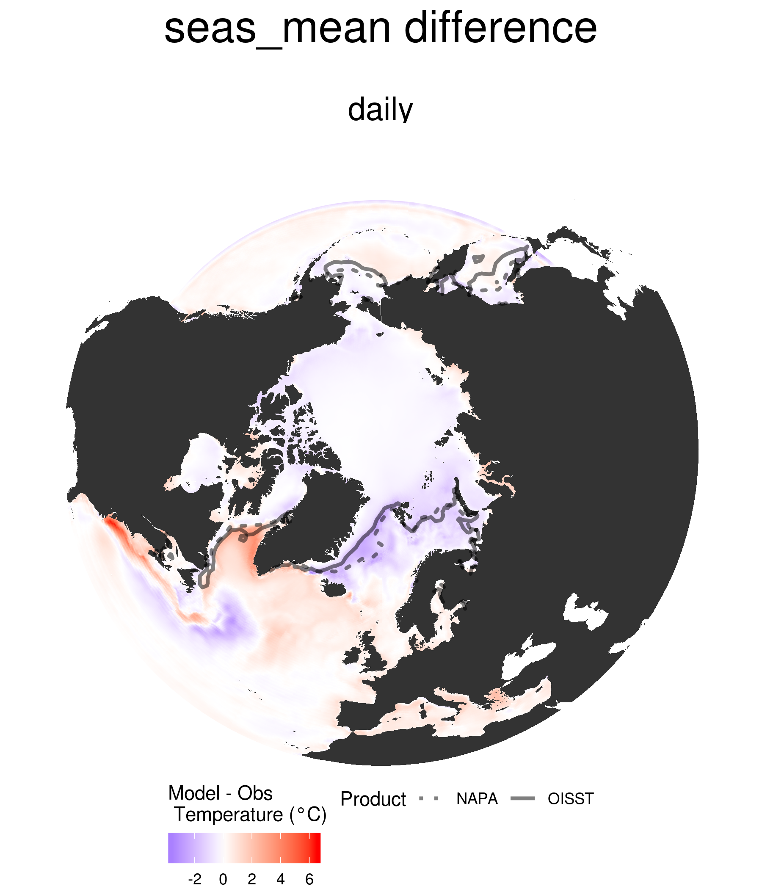
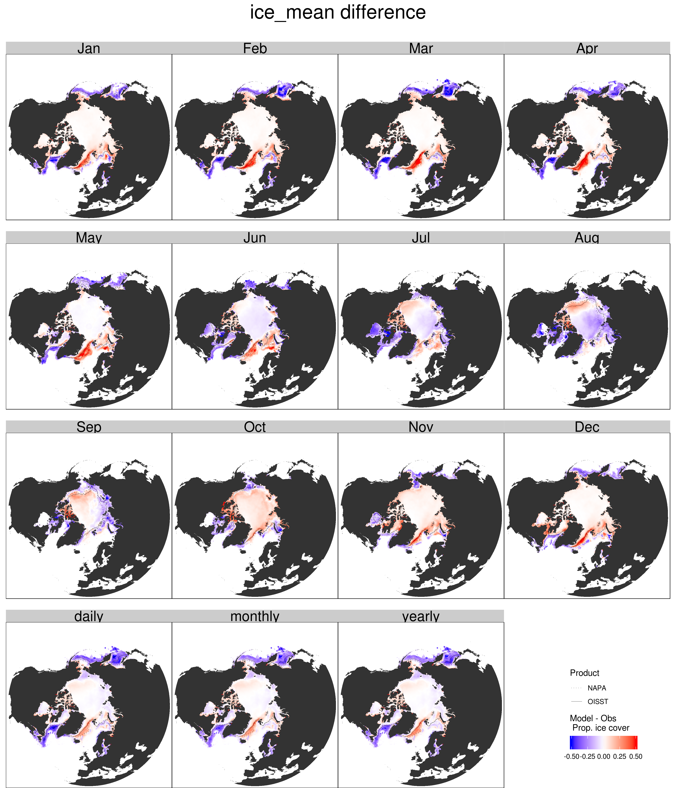
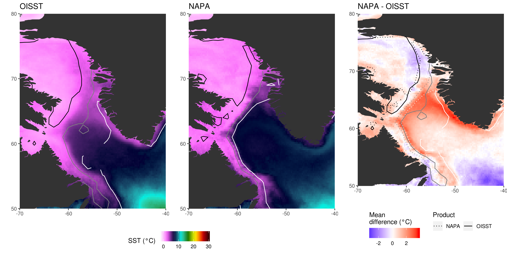
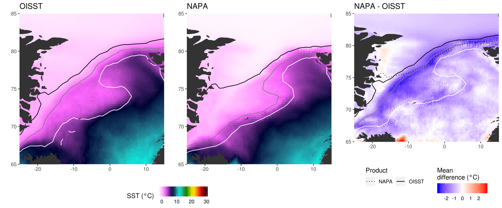

```{r, echo = FALSE}
library(knitr)
```


## Overview

The following select figures illustrate important differences between the NAPA model output and the NOAA OISST v2 product for SST and proportions of ice coverage. AVISO+ SLA is used to compare against the SSH present in the NAPA model.
  
There are many more figures available showing a multitude of comparisons, but only select figures that highlight important differences are shown here.
  
Please provide me with a USB stick or hard drive if you would like the full output as it is ~260 MB.

We are interested in ocean temperature extremes (OTE). And so the main focus of this presentation is on potential biases in the model w.r.t. SST and ice coverage.


## Product Introduction

- NAPA model
    - Tri-polar grid system
    - From mid Atlantic to northern Pacific
    - Daily SST
    - Other values at 5 day steps
- NOAA Optimally Interpolated Sea Surface Temperature (hereafter OISST)
    - 1/4 degree even global grid
    - Daily SST
- AVISO+ Sea Level Anomalies (hereafter AVISO)
    - Same grid as OISST
    - Daily SLA

```{r, echo = FALSE, fig.align='center'}
include_graphics("graph/diff_figs/distance.png")
```


## SST Mean

```{r, echo = FALSE, fig.align='center'}
include_graphics("graph/diff_figs/mean_tri_panel.png")
```


## SST Decadal Trend

```{r, echo = FALSE, fig.align='center'}
include_graphics("graph/diff_figs/dt_tri_panel.png")
```


## Correlations - detrended

```{r, echo = FALSE, fig.align='center'}
include_graphics("graph/diff_figs/cor_flat_difference.png")
```


## Seasonal Climatology - mean

```{r, echo = FALSE, fig.align='center'}

```


## Seasonal Climatology - Kolmogorov-Smirnov

```{r, echo = FALSE, fig.align='center'}

```

## Ice Coverage Mean

```{r, echo = FALSE, fig.align='center'}

```


## Problem Area - Gulf Stream 1/2

- Large persistent ocean features, such as the Gulf Stream seen below, may be visualised through skewness in spatial distribution of sea surface height (SSH) anomalies (Thompson & Demirov 2006)  
- We may therefor visualise the difference in the path of the Gulf Stream between model vs. obs by comparing maps of SLA skewness

### SLA Only

```{r, echo = FALSE, fig.align='center'}
include_graphics("graph/GS/skewness.png")
```


## Problem Area - Gulf Stream 2/2
### SLA + SST

```{r, echo = FALSE, fig.align='center'}

```


## Problem Area - Labrador Sea

```{r, echo = FALSE, fig.align='center'}

```


## Problem Area - Greenland Sea

```{r, echo = FALSE, fig.align='center'}

```


## Marine Heatwaves Definition 1/4
### Time series

```{r, echo = FALSE, fig.align='center'}
include_graphics("graph/presentations/ts_full.png")
```


## Marine Heatwaves Definition 2/4
### Daily boxes

```{r, echo = FALSE, fig.align='center'}
include_graphics("graph/presentations/ts_box.png")
```


## Marine Heatwaves Definition 3/4
### Thresholds

```{r, echo = FALSE, fig.align='center'}
include_graphics("graph/presentations/ts_box_clim.png")
```


## Marine Heatwaves Definition 4/4
### Events

```{r, echo = FALSE, fig.align='center'}
include_graphics("graph/presentations/MHW.png")
```


## Marine Heatwave Count

```{r, echo = FALSE, fig.align='center'}
include_graphics("graph/diff_figs/count_tri_panel.png")
```


## Marine Heatwave Duration - Min

```{r, echo = FALSE, fig.align='center'}

```


## Marine Heatwave Duration - Mean

```{r, echo = FALSE, fig.align='center'}
include_graphics("graph/diff_figs/duration_mean_tri_panel.png")
```


## Marine Heatwave Duration - Max

```{r, echo = FALSE, fig.align='center'}
include_graphics("graph/diff_figs/duration_max_tri_panel.png")
```


## Marine Heatwave Duration - _t_-test

```{r, echo = FALSE, fig.align='center'}
include_graphics("graph/diff_figs/duration_t_test_difference.png")
```


## Marine Heatwave Intensity - Mean

```{r, echo = FALSE, fig.align='center'}
include_graphics("graph/diff_figs/intensity_max_mean_tri_panel.png")
```


## Marine Heatwave Duration - _t_-test

```{r, echo = FALSE, fig.align='center'}
include_graphics("graph/diff_figs/intensity_max_t_test_difference.png")
```


## Conclusions - SST

```{r, echo=FALSE, eval=FALSE}
# Expand on this... monthly stats for example
OISST_NAPA_SST_summary %>% 
  filter(product == "difference") %>% 
  summarise(min(mean, na.rm = T),
            mean(mean, na.rm = T),
            max(mean, na.rm = T))
```

* Overall mean difference is -0.2°C  
* Mean differences per pixel range from -9 -- 10°C  
* Correlations between pixels are generally strong, with the exception of the arctic ice covered area
    * The strength of the correlations has a seasonal cycle, with winter months being the weakest
* Three important problem areas:  
    * Gulf Stream
    * Labrador Sea
    * Greenland Sea


## Conclusions - Gulf Stream

* The Gulf Stream path not as crisp in NAPA data, but mean pathway is similar
* The northern edge of the Gulf Stream is warmer in the NAPA data
* The warmer signal around the Scotian Shelf is not from a North shifted Gulf Stream
* May be from more influence of the Gulf Stream on shelf waters
* This may be due to the "bump" in the mean path of the Gulf Stream in the NAPA data as it diverges from the continent
* This may be because the Labrador Sea is not flowing southwestward to the Gulf of Maine in the NAPA data as much as in the OISST data


## Conclusions - Labrador Sea

* The northern Labrador Sea is warmer in the NAPA data
* The southern Labrador Sea is warmer in the OISST data
* The gradient from cold to warm is larger and more gradual in OISST data
* This all appears to be due to the much more gradual ice coverage in the OISST data


## Conclusions - Greenland Sea

* The ice coverage over the Greenland Sea extends much further south and east in the NAPA data
* This causes the SST here to be much cooler in the NAPA data


## Conclusions - Climatologies

* The seasonal signals per pixel are more similar per month than they are overall
* Most overall pixels significantly different
* Areas where the overall signals are significantly different we still see the borders of meso-scale features highlighted as not significantly different
* This implies that the model is resolving the different meso-scale features in the study area accurately spatially, but that the phenology of the features differ


## Conclusions - Marine heatwaves

* Most pixels show an agreement between the mean duration and intensity of MHWs
* When taken as an overall time series these differences are mostly significant
* The overall spatial agreement of durations is almost inverted from the spatial agreement of maximum intensities
* This is likely due to the very large difference in the duration of events between the datasets
* The model shows fewer events per pixel that tend to be longer
    * This is likely due to differences in autocorrelation between model and obs
    * This is very typical of model data as they tend to be less noisy than observations
* The NAPA data have much longer events on average that are less intense


## Questions?